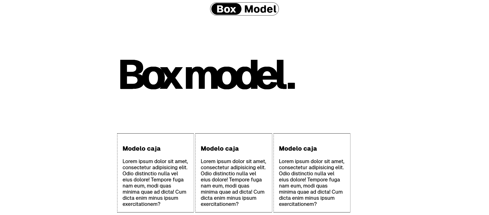

# 🥈Prueba HTML y CSS de Box Model

Te damos la bienvenida a la primera prueba técnica del proceso de selección como __Trainee Software Developer con HTML y CSS__.

## Trabajar con conceptos del modelo caja en CSS

### Requisitos

1. Tener instalado __VSC__
2. **Duración máxima**: 40 minutos

### Enunciado

```bash
Crear una página web pensado para mostrar en español.

Reproducir la captura que viene a continuación.

Para centrar un elemento "inline-block" o "block" se utiliza la propiedad "margin" con valor "auto".

Utilizar la fuente "geist" que facilitamos en los enlaces de las instrucciones
```
## Captura



## Enlaces
- [] _El código debe ser enteramente desarrollado en HTML y CSS._
- [] _Cargar la fuente Geist del siguiente [enlace](https://vercel.com/font/sans)._
Para ver como cargar una fuente consultar [font-face](https://developer.mozilla.org/es/docs/Web/CSS/@font-face) de __MDN__

